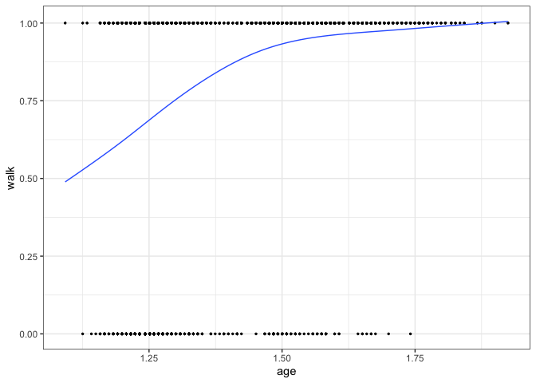
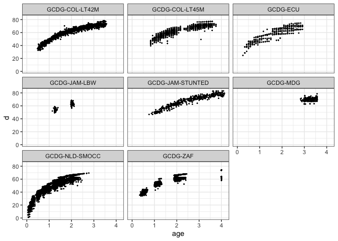

<!-- README.md is generated from README.Rmd. Please edit that file -->

# childdevdata

<!-- badges: start -->

[](https://lifecycle.r-lib.org/articles/stages.html#stable)
<!-- badges: end -->

The goal of `childdevdata` is to support innovation in child
development. The package

1.  Makes anonymous microdata available to the research community;
2.  Adopts a simple naming schema for developmental milestones;
3.  Supports multiple measurement instruments;
4.  Eases joint analyses of the data.

The current version bundles milestone data from ten studies, containing
1,116,061 assessments made on 10831 unique children during 28465 visits,
covering 21 different instruments.

## Installation

<!-- You can install the released version of childdevdata from [CRAN](https://CRAN.R-project.org) with: -->

You can install the development version of `childdevdata` from
[GitHub](https://github.com) with: –&gt;

``` r
install.packages("remotes")
remotes::install_github(repo = "d-score/childdevdata")
```

## Example

The following example visualises how the proportion of toddlers that are
able to walk increases with age.

``` r
library(childdevdata)
library(ggplot2)

# we use the Dutch SMOCC data
data <- with(gcdg_nld_smocc, 
             data.frame(age = round(agedays/365.25, 4),
                        walk = ddigmd068))
ggplot(na.omit(data), aes(age, walk)) +
  geom_point(cex = 0.5) +
  geom_smooth(method = "gam", formula = y ~ s(x, bs = "cs"), 
              se = FALSE, lwd = 0.5) +
  theme_bw()
```



## Overview of available dataset and documentation

The package contains multiple datasets. Obtain the list of datasets by

``` r
data(package = "childdevdata")$results[, "Item"]
#>  [1] "gcdg_chl_1"       "gcdg_chn"         "gcdg_col_lt42m"   "gcdg_col_lt45m"  
#>  [5] "gcdg_ecu"         "gcdg_jam_lbw"     "gcdg_jam_stunted" "gcdg_mdg"        
#>  [9] "gcdg_nld_smocc"   "gcdg_zaf"
```

The documentation of the data can be found by typing into the console:

``` r
?gcdg_col_lt42m
```

The size of the data is

``` r
dim(gcdg_col_lt42m)
#> [1] 1311  627
```

The first six rows and first nine columns are

``` r
head(gcdg_col_lt42m[, 1:9])
#> # A tibble: 6 x 9
#>   ctrycd cohort       cohortn  subjid agedays sex   gagebrth aqicmc010 aqicmc013
#>   <chr>  <chr>          <int>   <int>   <int> <chr>    <int>     <int>     <int>
#> 1 COL    GCDG-COL-LT…      50 5000001     660 Fema…      224        NA        NA
#> 2 COL    GCDG-COL-LT…      50 5000002    1166 Fema…      280        NA        NA
#> 3 COL    GCDG-COL-LT…      50 5000003     314 Fema…      273        NA        NA
#> 4 COL    GCDG-COL-LT…      50 5000004    1239 Fema…      259        NA        NA
#> 5 COL    GCDG-COL-LT…      50 5000005     679 Fema…      224        NA        NA
#> 6 COL    GCDG-COL-LT…      50 5000006    1074 Fema…      252        NA        NA
```

The first seven columns are administrative and background variables.
Column numbers eight and up hold the milestone scores.

## Combining data

Concatenating two or more data is straightforward using `dplyr`. The
following code concatenates all avialable GCDG datasets.

``` r
library(dplyr)
#> 
#> Attaching package: 'dplyr'
#> The following objects are masked from 'package:stats':
#> 
#>     filter, lag
#> The following objects are masked from 'package:base':
#> 
#>     intersect, setdiff, setequal, union
alldata <- bind_rows(gcdg_chl_1, gcdg_chn, gcdg_col_lt42m, gcdg_col_lt45m, gcdg_ecu, gcdg_jam_lbw, gcdg_jam_stunted, gcdg_mdg, gcdg_nld_smocc, gcdg_zaf)
dim(alldata)
#> [1] 28465  1306
```

Both the number of rows and the number of columns have increased.
Milestones not appearing in a particular data obtain all missing (`NA`)
scores.

The number of records per cohort by sex is

``` r
table(alldata$cohort, alldata$sex)
#>                   
#>                    Female Male
#>   GCDG-CHL-1          970 1169
#>   GCDG-CHN            509  481
#>   GCDG-COL-LT42M      646  665
#>   GCDG-COL-LT45M      651  684
#>   GCDG-ECU            337  330
#>   GCDG-JAM-LBW        242  201
#>   GCDG-JAM-STUNTED    207  270
#>   GCDG-MDG            113   92
#>   GCDG-NLD-SMOCC     8499 8223
#>   GCDG-ZAF           2154 2018
```

## Calculating D-score and DAZ

The [`dscore` package](https://d-score.org/dscore/) calculates the
*D-score* ([van Buuren 2014](#ref-vanbuuren2014)) and the *D-score
adjusted for age Z-score* (DAZ) for all cases:

``` r
library(dscore)
alldata$age <- round(alldata$agedays/365.25, 4)
d <- dscore(alldata)
head(d)
#>       a  n     p    d   sem    daz
#> 1 1.024 29 0.690 50.4 0.666  0.286
#> 2 1.509 22 0.955 57.8 1.445  0.269
#> 3 0.975 29 0.724 50.8 0.682  0.742
#> 4 1.016 29 0.759 51.3 0.700  0.649
#> 5 1.016 22 0.682 49.1 0.677 -0.099
#> 6 1.517 25 0.840 56.9 1.058 -0.070
dim(d)
#> [1] 28465     6
```

We visualise the D-score distribution by age per cohort as

``` r
alldata <- bind_cols(alldata, d)
ggplot(alldata, aes(age, d, group = cohort)) +
  geom_point(cex = 0.3) +
  facet_wrap(~ cohort) +
  ylab("D-score") + xlab("Age (years)") +
  theme_bw()
#> Warning: Removed 380 rows containing missing values (geom_point).
```



## Why this package?

We all want our children to grow and prosper. While there is no shortage
of apps and instruments to track child development, it is often unclear
which data went into the construction of these tools. In order to
improve measurement and norm setting of child development, we need
child-level response data per milestone and age. However, no such public
dataset seem to exist. The `childdevdata` package fills that void.

The package grew out of a project in which we collected milestone data
from 16 cohorts. See [Weber et al.](#ref-weber2019)
([2019](#ref-weber2019)) and <http://d-score.org/dbook2/> for results.
Ten cohort owners graciously decided to make their data available for
third parties. We are grateful to them.

## How to use the data?

Tremendous effort has gone into the collection and harmonisation of the
data. You can use the data in this package under the [CC BY
4.0](https://creativecommons.org/licenses/by/4.0/) license. Basically,
this means that you may share and adapt the data, on the condition that
you give appropriate credit and clearly indicate any changes you’ve
made. See the license text for details.

We expect that you will properly cite the source data when you use the
data in your own product or publication, as follows:

-   If you use one dataset, please cite the publication(s) given in the
    documentation of that dataset.
-   If you use two or more datasets, cite the publication(s) for each
    dataset *and* cite the `childdevdata` package.

The citation of the `childevdata` package is

    @Manual{childevdata-package,
        title = {Child Development Data},
        author = {Stef {van Buuren} and Iris Eekhout and Marta Rubio Codina and Orazio Attanasio and Costas Meghir and 
        Emla Fitzsimons and Sally Grantham-McGregor and Maria Caridad Araujo and Susan Walker and Susan Chang and 
        Christine Powell and Ann Weber and Lia Fernald and Paul Verkerk and Linda Richter and Betsy Lozoff},
        year = {2021},
        note = {R package version 1.0.0},
        url = {https://github.com/d-score/childdevdata},
      }

## Want to contribute?

Do you have similar data and want to help others to advance the field?
Please let us know. We hope that the `childdevdata` package may continue
to grow into a valuable resource for developers and researchers
worldwide.

## References

<div id="refs" class="references csl-bib-body hanging-indent">

<div id="ref-vanbuuren2014" class="csl-entry">

van Buuren, S. 2014. “Growth Charts of Human Development.” *Statistical
Methods in Medical Research* 23 (4): 346–68.
<https://stefvanbuuren.name/publication/van-buuren-2014-gc/>.

</div>

<div id="ref-weber2019" class="csl-entry">

Weber, A. M., M. Rubio-Codina, S. P. Walker, S. van Buuren, I. Eekhout,
S. Grantham-McGregor, M. C. Araujo, et al. 2019. “The D-Score: A Metric
for Interpreting the Early Development of Infants and Toddlers Across
Global Settings.” *BMJ Global Health* 4: e001724.
<https://gh.bmj.com/content/bmjgh/4/6/e001724.full.pdf>.

</div>

</div>
